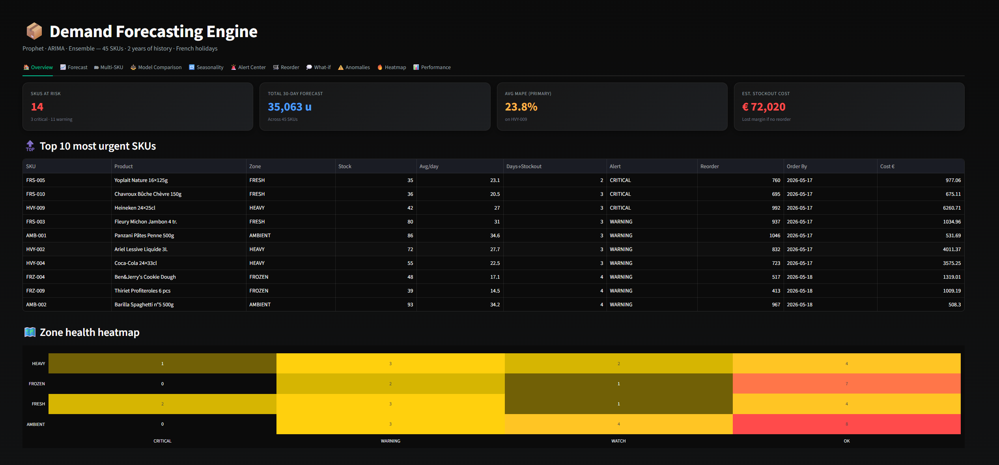

# 📦 Demand Forecasting Engine


**Project 3** of the Warehouse Logistics Suite by **Iyad Belkadi**.
Production-grade demand forecasting for warehouse operations — Prophet, ARIMA, ensemble models, stock alerts, and reorder recommendations across 45 real French SKUs.



---

## ✨ Features

- **45 real French SKUs** across 4 warehouse zones (Frozen, Fresh, Ambient, Heavy)
- **2 years of synthetic daily history** with realistic seasonality, weekly patterns, French holidays, stockouts, and promotional spikes
- **4 forecasting models**:
  - Simple & weighted moving average (baselines)
  - **Prophet** (Meta) with French holidays as regressors
  - **SARIMA** with automatic AIC-based parameter selection
  - **Ensemble** with dynamic inverse-MAE weighting per SKU
- **Full accuracy suite** — MAE, RMSE, MAPE, bias, CI coverage
- **Smart stock alerts** — CRITICAL · WARNING · WATCH · OK with safety-stock logic
- **Reorder recommendations** with priority scoring, supplier grouping, and PDF / Excel purchase-order exports
- **Anomaly detection** — statistical z-score + tracked stockouts, promos, delivery surges
- **Cross-SKU heatmaps & correlation** matrix
- **10 interactive tabs** in a polished dark-themed Streamlit UI

---

## 🧱 Tech Stack

| Layer | Tool |
|---|---|
| UI | Streamlit + streamlit-extras + Plotly |
| Forecasting | Prophet · statsmodels (SARIMAX) · scikit-learn |
| Data | pandas · numpy |
| Exports | openpyxl (Excel) · reportlab (PDF) |
| Holidays | `holidays` (France) |

---

## 🚀 Installation

```bash
git clone https://github.com/iyadbelkadi/demand-forecasting-engine.git
cd demand-forecasting-engine
python -m venv venv
source venv/bin/activate          # Windows: venv\Scripts\activate
pip install -r requirements.txt
streamlit run app.py
```

The first launch generates **2 years × 45 SKUs ≈ 33,000 daily demand rows** and caches them to `data/sample_data.csv`. Subsequent launches load instantly.

---

## 📐 Project Structure

```
demand-forecasting-engine/
├── app.py                        # Streamlit application (10 tabs)
├── requirements.txt
├── README.md
│
├── core/
│   ├── preprocessor.py           # Series extraction, train/test split
│   ├── moving_avg.py             # Simple + weighted MA baselines
│   ├── prophet_model.py          # Prophet wrapper + French holidays
│   ├── arima_model.py            # SARIMA with auto-AIC selection
│   ├── ensemble.py               # Inverse-MAE weighted ensemble
│   ├── metrics.py                # MAE, RMSE, MAPE, bias, coverage
│   ├── alerts.py                 # Stock alert classification
│   ├── recommender.py            # Reorder priority + PDF/Excel export
│   └── orchestrator.py           # Cached forecasting pipeline
│
├── data/
│   ├── catalog.py                # 45 French SKUs (shared with Project 2)
│   ├── generator.py              # Synthetic 2-year history generator
│   └── sample_data.csv           # Auto-generated cache
│
└── assets/
    └── style.css                 # Dark theme
```

---

## 🎯 The 10 Tabs

| # | Tab | What it shows |
|---|---|---|
| 1 | Overview | KPI cards, top-10 urgent SKUs, zone health heatmap |
| 2 | Forecast | Deep-dive on one SKU with all 4 models + CI bands |
| 3 | Multi-SKU | Grid of Prophet forecasts (up to 10 SKUs) |
| 4 | Model Comparison | All 4 models on one chart + residual histograms |
| 5 | Seasonality | Prophet trend, weekly, yearly, holiday components |
| 6 | Alert Center | Filterable table of all 45 SKUs with alert levels |
| 7 | Reorder | Ranked reorder list + supplier grouping + PDF/Excel |
| 8 | Anomaly Detection | Statistical anomalies + event log w/ impact |
| 9 | Heatmap & Patterns | SKU × day-of-week / month heatmaps, correlations |
| 10 | History & Performance | Backtest, cumulative error, best model per SKU |

---

## 🧪 Live Demo

https://demand-forecasting-engine.streamlit.app/

---

## 🔗 Related Projects

This is the **third** project in the warehouse logistics series:

1. **[Warehouse KPI Dashboard](../warehouse-kpi-dashboard)** — real-time operational KPIs (Project 1)
2. **[Picking Route Optimizer](../picking-route-optimizer)** — pick-path optimization (Project 2)
3. **Demand Forecasting Engine** — *this project* (Project 3)

---

## 👤 Author

**Iyad Belkadi**
*Data & operations enthusiast — supply-chain analytics, optimization, forecasting.*

---

## 📜 License

MIT
